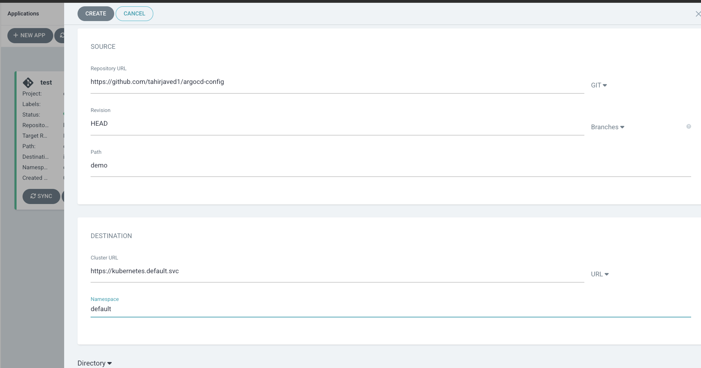
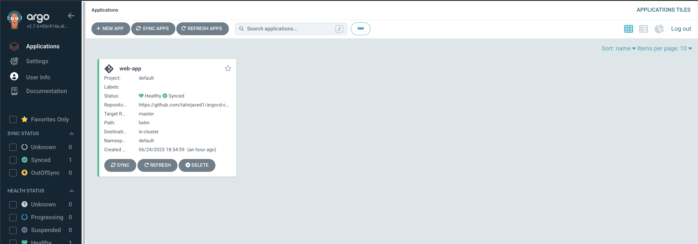
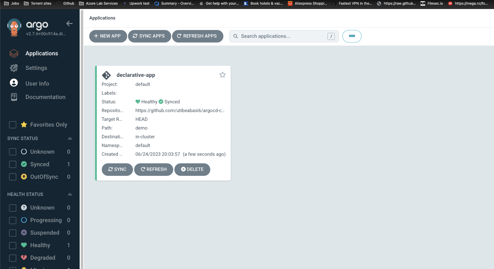
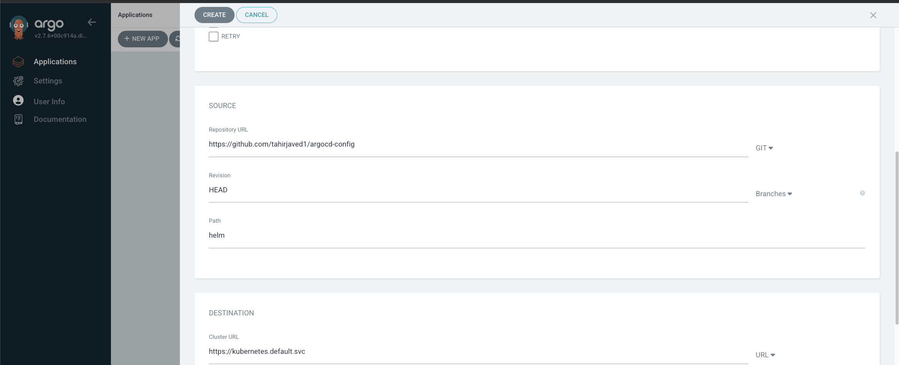
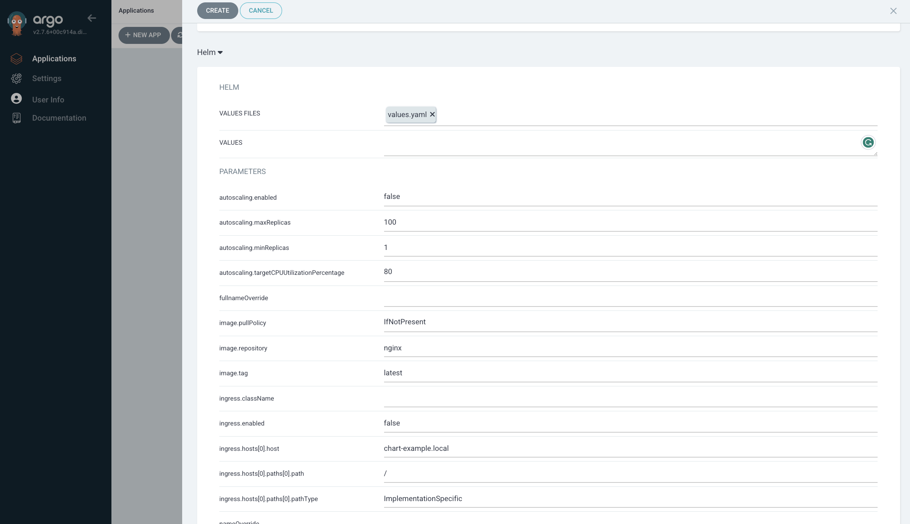

## Introduction to GitOps:
GitOps is a software development and operations (DevOps) methodology that leverages Git as the single source of truth for managing infrastructure and application deployments. With GitOps, the desired state of the system is defined in Git repositories, and tools automate the process of applying those changes to the target environment.

### Why use GitOps:

- Infrastructure as Code: GitOps treats infrastructure and application configuration as code, enabling version control, collaboration, and reproducibility.
- Continuous Delivery: GitOps enables a continuous delivery workflow, where any changes committed to Git are automatically deployed to the target environment.
- Auditing and Rollbacks: Git provides an audit trail of all changes, allowing easy rollbacks to previous states if issues occur.
- Consistency and Standardization: GitOps ensures consistent and standardized deployments across different environments.

### Using GitOps with Kubernetes:
GitOps is particularly well-suited for managing Kubernetes clusters. Kubernetes resources, such as deployments, services, and configurations, can be defined in Git repositories, and GitOps tools take care of synchronizing the desired state with the actual cluster.

### Steps to use GitOps with Kubernetes:

1. Set up a Git repository: Create a Git repository to store the desired state of your Kubernetes cluster. This repository will hold the configuration files for your Kubernetes resources.
2. Define the desired state: Create YAML files for your Kubernetes resources (deployments, services, etc.) in the Git repository. Ensure that the files reflect the desired state of your cluster.
3. GitOps tool installation: Install a GitOps tool like FluxCD, which will continuously monitor the Git repository and apply changes to the Kubernetes cluster.
4. Configure GitOps tool: Connect the GitOps tool to the Git repository and provide necessary access credentials. Specify the target Kubernetes cluster for deploying changes.
5. Automation and synchronization: The GitOps tool will monitor the Git repository for changes. Any new commits or updates trigger the synchronization process, where the tool applies the changes to the Kubernetes cluster automatically.


### ArgoCD Basics

In this section, we will take a deep dive into ArgoCD, what it is, how to install, and how to deploy a basic application into it.

ArgoCD allows us to use Git as a single source of truth. This means that we define all our application configuration as code in a Git repository and ArgoCD updates our cluster to match what is defined in the repository.

In addition to watching the Git repository, it also watches the Kubernetes cluster for changes and syncs the state of the cluster back to what is defined in the Git repository if a change is detected in the cluster. Interestingly, a single ArgoCD installation can be used to manage multiple clusters as well.

Let’s install ArgoCD and take a look at it in action.

**Prerequisites**
To fully understand what will be covered in this part of the tutorial, here are the things you should set up on your computer:

- A Kubernetes cluster: We will be deploying applications to Kubernetes and as such, you need to have access to a Kubernetes cluster. For this tutorial, we will be using a tool called minikube to setup a local Kubernetes cluster for development. You can install it [here](https://minikube.sigs.k8s.io/docs/start/).
- kubectl: We need kubectl in order to run commands against our Kubernetes cluster. You can install it [here](https://kubernetes.io/docs/tasks/tools/install-kubectl/).
- Helm: Helm is a package manager for Kubernetes. Later in the tutorial, we will take a look at how we can deploy helm charts with ArgoCD so you need to have it installed. Follow the steps [here](https://helm.sh/docs/intro/install/).
- Finally, you’ll need to have basic knowledge of Kubernetes and the kubectl command-line tool.


## Installation

To install ArgoCD, follow these steps:

1. Create a new namespace for ArgoCD by running the command `kubectl create namespace argocd`. This namespace will be used to group all the ArgoCD resources.

2. Install all the necessary services and applications for ArgoCD into the newly created namespace. Use the following command to do this:


To install ArgoCD, use the following `kubectl` command:

```bash
kubectl apply -n argocd -f https://raw.githubusercontent.com/argoproj/argo-cd/stable/manifests/install.yaml
```

This command fetches the installation manifest from the official ArgoCD repository and applies it to the `argocd` namespace.

3. After running the installation command, check the status of the ArgoCD pods by executing `kubectl get pod -n argocd`. You should see the ArgoCD pods being created in your cluster. If any pods are in a Pending state, wait for a few seconds and run the command again to ensure that the pods are running before proceeding to the next step.

Now that ArgoCD is successfully installed, you can proceed to the next steps to explore its functionality.


## Generating ArgoCD UI Password

Now that the ArgoCD pods are up and running, we can access the ArgoCD web user interface (UI). However, before we proceed, we need to generate a password that will be used to log in to the ArgoCD UI. 

To generate the password, execute the following command:

```bash
kubectl -n argocd get secret argocd-initial-admin-secret -o jsonpath="{.data.password}" | base64 -D; echo
```

Make sure you store this password securely as it will be used to gain access to your ArgoCD UI. Now, port-forward the argocd-server service to port 8080 of your local machine.

```bash
kubectl port-forward svc/argocd-server -n argocd 8080:443
```


Navigate to http://localhost:8080 in your browser and you should be greeted with a screen similar to the one below.


Sign in with the username ```admin``` and the password you got from the previous step. On doing this, you should now see the ArgoCD web UI.


To deploy a basic application using ArgoCD, follow these steps:

1. Fork the Git repository created for this tutorial. You can find the repository [here]([repository_url](https://github.com/tahirjaved1/argocd-config)). This repository contains all the necessary files for the deployment.

2. Access the ArgoCD web UI and click on "Create application" or "New app".

3. Fill in the following details in the provided fields:

   - **Application Name**: Choose a name for your ArgoCD application. For this tutorial, we'll use "web-app", but you can use any name you prefer.
   
   - **Sync policy**: This determines how ArgoCD handles synchronization with the cluster when changes are detected in Git. For now, set this to "Manual".
   
   - **Project**: Set this to "default".
   
   - **Source**: Enter the URL of the Git repository you forked earlier.
   
   - **Path**: Specify the folder within the repository where your application manifest files reside. In this case, the folder is named "demo".
   
   - **Cluster URL**: This refers to the URL of the Kubernetes cluster you are connecting to. Since you are connecting to a local cluster, set this to "https://kubernetes.default.svc".
   
   - **Namespace**: This refers to the namespace where your application will be deployed. Set this to "default".

After completing the above steps, your application deployment configuration will be created in ArgoCD.


Make sure you select source and the destination for the application deployment.

- Source should be demo folder which has deployment.yaml file
- Destination should be kuberentes.



Click on create button. Your application will be deployed.




Lets talk about the Sync strategies used in the argocd.

There are 3 syncing options.

1. Manual or Automatic: This is used when you want argocd do the action when a new change is detected in Git.
2. Auto Prune: This will delete the cluster state when a file is deleted which was deployed.
3. Self Heal: As the name suggest, it will heal the changes made in the Git. It will revert the manual changes to automatic by the argocd.

There are other options as well to deploy the application in argocd. 

1. Deploy application in Production with Declarative Approach

Previously, we have used argocd dashboard UI to deploy the application. But that's not great if we are deploying something in production. For the real world application it is always recommended to deploy applications via declarative approach. Declarative approach means that you will have to create manifests of the application to be deployed in yaml. 

Lets deploy it.

I have an application.yaml file 

```bash
apiVersion: argoproj.io/v1alpha1
kind: Application
metadata:
  name: declarative-app
  namespace: argocd
spec:
  project: default
  source:
    repoURL: https://github.com/tahirjaved1/argocd-config
    targetRevision: HEAD
    path: "demo"
  destination:
    server: https://kubernetes.default.svc
    namespace: default
  syncPolicy:
    automated:
      selfHeal: true
      prune: true
```

1. Delete the existing deployed application from the dashboard.
2. Deploy it by using kubectl command
```bash
kubectl apply -f application.yaml -n argocd
```


As you can see it is automatically deployed and can be shown inside argocd dashboard.



2. Deploy application with Helm charts

We have seen the deployment methods starting from UI to then declarative method. We can deploy it with helm charts and the CLI option as well.

We have Helm charts available in the repo. It has values.yaml file for storing the values. Lets deploy it. 

The only thing that changes is the configuration we set in the dashboard UI. 

- Click on creating new application
- Set the Repo url and the branch
- Make sure select the folder helm this time to select the helm charts instead of other deployment yamls.


Once you select helm folder it will automatically detect the values.yaml file as shown below. 



- Click on create
It will automatically sync the project and run it into the default namespace.

We can deploy application with Cli based Argocd tool as well.


----------------

### FluxCD Basics

FluxCD is an open-source tool that facilitates GitOps practices for continuous delivery and deployment of applications and infrastructure. It enables the automation and synchronization of deployments based on changes in Git repositories. 

### Features of FluxCD

- Continuous Delivery: FluxCD enables organizations to achieve continuous delivery by automating the deployment and release processes. It monitors Git repositories for changes in application or infrastructure configurations and triggers deployments accordingly.

- GitOps Principles: FluxCD adheres to GitOps principles, where the desired state of the system is defined in Git repositories. It uses a declarative approach, where configuration files specify the desired state of applications and infrastructure, and FluxCD reconciles the actual state with the desired state.

- Automated Synchronization: FluxCD automatically synchronizes the desired state stored in Git with the running environments. It continuously monitors the Git repository for changes, and when a new commit is detected, it updates the target environment to reflect the changes.

- Application and Infrastructure Deployments: FluxCD can be used to manage both application and infrastructure deployments. It integrates with various container orchestration platforms like Kubernetes and cloud providers to automate deployments of containers, services, and infrastructure components.

- Rollback and Recovery: FluxCD provides the ability to rollback deployments in case of issues or errors. By maintaining a history of changes in Git, it allows organizations to easily revert to a previous version of the configuration and restore a known working state.

Scalability and Multi-Cluster Management: FluxCD supports managing multiple clusters and environments. It allows organizations to apply GitOps practices consistently across different environments, enabling scalability and reducing the complexity of managing deployments.

Use Cases for FluxCD:

- Kubernetes Deployments: FluxCD can be used to automate the deployment of Kubernetes applications. It monitors a Git repository containing Kubernetes manifests and automatically updates the target cluster whenever changes are pushed.

- Infrastructure as Code (IaC): FluxCD can be employed to manage Infrastructure as Code deployments. It can automatically update infrastructure configurations stored in Git repositories and trigger the deployment of infrastructure resources using tools like Terraform or AWS CloudFormation.

- Multi-Environment Deployments: When an organization has multiple environments, such as development, staging, and production, FluxCD can help synchronize the desired state across these environments. It ensures that the changes applied in the Git repository propagate consistently to each environment.

- GitOps for Configuration Management: FluxCD can be used to manage configuration files for various applications or services. It monitors Git repositories containing configuration files and automatically applies changes to the appropriate environments, ensuring consistent configuration management.

## Demo
